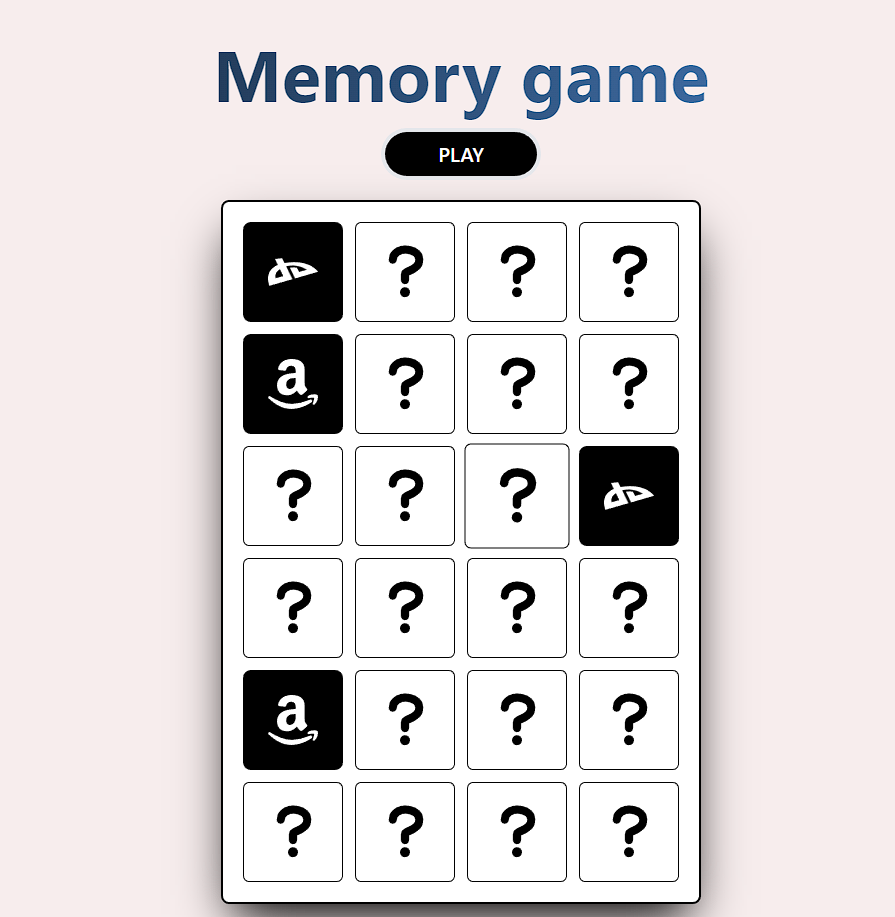

# Memory-game

Este código es un juego de memoria construido con React, una biblioteca de JavaScript para construir aplicaciones web. Utiliza el estado de React para almacenar y actualizar el estado del juego, como la posición de las tarjetas, las tarjetas seleccionadas y las tarjetas ganadas. También utiliza el hook de efecto de React para manejar la mezcla de tarjetas al comenzar un juego nuevo y para manejar la lógica de juego cuando se seleccionan dos tarjetas. El componente "Card" se encarga de mostrar las tarjetas y manejar las acciones de voltear la tarjeta al hacer clic en ella. El componente "App" es el componente principal que contiene la lógica del juego y los componentes "Card". El juego también tiene un botón de "Play" que permite al usuario mezclar las tarjetas y comenzar un nuevo juego, y una pantalla de finalización que se muestra cuando el usuario ha ganado el juego.

